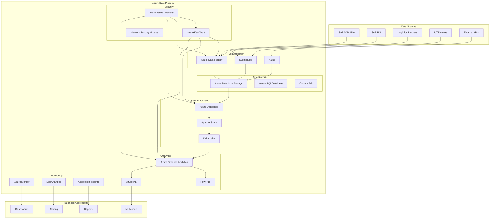
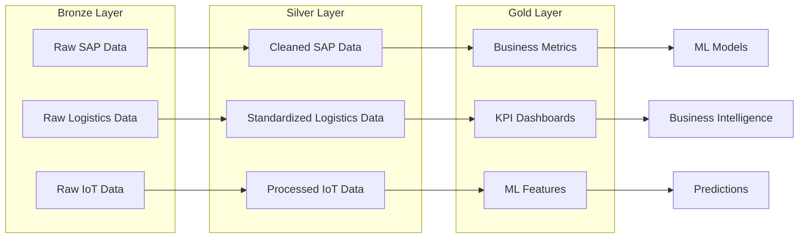

# Bosch Supply Chain Data Platform - Architecture

## Overview

The Bosch Supply Chain Data Platform is a comprehensive, cloud-native solution built on Microsoft Azure that enables predictive analytics, anomaly detection, and optimization for supply chain operations. The platform integrates data from multiple sources including SAP S/4HANA, logistics partners, and IoT devices to provide real-time insights and automated decision-making capabilities.

## Architecture Principles

### 1. Cloud-Native Design
- **Microservices Architecture**: Modular, loosely coupled services
- **Containerization**: Docker containers for consistent deployment
- **Serverless Components**: Event-driven, auto-scaling functions
- **API-First**: RESTful APIs for all services

### 2. Data-Driven Approach
- **Data Lake Architecture**: Multi-zone data storage (Bronze/Silver/Gold)
- **Real-time Processing**: Stream processing for immediate insights
- **Batch Processing**: Large-scale data transformation and analytics
- **Machine Learning**: AI-powered predictions and optimizations

### 3. Security and Compliance
- **Zero Trust Security**: Identity-based access control
- **Data Encryption**: At rest and in transit
- **Network Isolation**: Private endpoints and VNets
- **Audit Logging**: Comprehensive activity tracking

### 4. Scalability and Performance
- **Auto-scaling**: Dynamic resource allocation
- **Performance Optimization**: Caching and indexing strategies
- **Cost Management**: Resource optimization and monitoring
- **High Availability**: Multi-region deployment capabilities

## System Architecture

### High-Level Architecture



### Data Flow Architecture



## Component Architecture

### 1. Data Ingestion Layer

#### Azure Data Factory
- **Purpose**: Orchestrate data movement and transformation
- **Features**: 
  - SAP S/4HANA and R/3 connectors
  - Real-time and batch processing
  - Data quality validation
  - Error handling and retry logic

#### Event Hubs
- **Purpose**: Stream processing for real-time data
- **Features**:
  - High-throughput message ingestion
  - IoT device connectivity
  - Event routing and filtering
  - Schema registry integration

#### Kafka
- **Purpose**: Message queuing and event streaming
- **Features**:
  - Distributed messaging
  - Topic-based routing
  - Consumer group management
  - Message persistence

### 2. Data Storage Layer

#### Azure Data Lake Storage Gen2
- **Purpose**: Centralized data lake for all data types
- **Structure**:
  - **Bronze Zone**: Raw, unprocessed data
  - **Silver Zone**: Cleaned and standardized data
  - **Gold Zone**: Business-ready, aggregated data
- **Features**:
  - Hierarchical namespace
  - Access control lists (ACLs)
  - Lifecycle management
  - Encryption at rest

#### Azure SQL Database
- **Purpose**: Relational data storage and OLTP
- **Features**:
  - Transactional consistency
  - ACID compliance
  - Backup and recovery
  - Performance tuning

#### Cosmos DB
- **Purpose**: NoSQL document storage
- **Features**:
  - Global distribution
  - Multi-model support
  - Automatic scaling
  - Low latency access

### 3. Data Processing Layer

#### Azure Databricks
- **Purpose**: Big data processing and analytics
- **Features**:
  - Apache Spark clusters
  - Delta Lake integration
  - MLflow model management
  - Collaborative notebooks
  - Unity Catalog (data governance)

#### Apache Spark
- **Purpose**: Distributed data processing
- **Features**:
  - Batch and streaming processing
  - Machine learning libraries
  - Graph processing
  - SQL analytics

#### Delta Lake
- **Purpose**: Data lakehouse architecture
- **Features**:
  - ACID transactions
  - Schema evolution
  - Time travel
  - Data versioning
  - Optimized file formats

### 4. Analytics Layer

#### Azure Synapse Analytics
- **Purpose**: Data warehousing and analytics
- **Features**:
  - SQL analytics
  - Spark integration
  - Data integration
  - Power BI connectivity
  - Serverless SQL pools

#### Power BI
- **Purpose**: Business intelligence and visualization
- **Features**:
  - Interactive dashboards
  - Real-time reports
  - Mobile access
  - Embedded analytics
  - Natural language queries

#### Azure Machine Learning
- **Purpose**: ML model development and deployment
- **Features**:
  - Automated ML
  - Model training and validation
  - Model deployment
  - MLOps integration
  - Responsible AI tools

### 5. Security Layer

#### Azure Key Vault
- **Purpose**: Secrets and certificate management
- **Features**:
  - Centralized key management
  - Hardware security modules (HSM)
  - Access policies
  - Audit logging
  - Key rotation

#### Azure Active Directory
- **Purpose**: Identity and access management
- **Features**:
  - Single sign-on (SSO)
  - Multi-factor authentication
  - Role-based access control
  - Conditional access
  - Identity protection

#### Network Security Groups
- **Purpose**: Network-level security
- **Features**:
  - Traffic filtering
  - Port restrictions
  - IP address filtering
  - Service tags
  - Application security groups

### 6. Monitoring Layer

#### Azure Monitor
- **Purpose**: Comprehensive monitoring and alerting
- **Features**:
  - Metrics collection
  - Log aggregation
  - Alert rules
  - Action groups
  - Custom dashboards

#### Log Analytics
- **Purpose**: Log data analysis and querying
- **Features**:
  - KQL queries
  - Log search
  - Data visualization
  - Alert creation
  - Workbook templates

#### Application Insights
- **Purpose**: Application performance monitoring
- **Features**:
  - Performance tracking
  - Error monitoring
  - User analytics
  - Dependency tracking
  - Custom telemetry

## Data Architecture

### Data Lake Zones

#### Bronze Zone
- **Purpose**: Store raw, unprocessed data
- **Data Types**: JSON, CSV, XML, binary files
- **Retention**: 7 years
- **Access**: Data engineers, data scientists
- **Examples**: Raw SAP tables, IoT sensor data, API responses

#### Silver Zone
- **Purpose**: Store cleaned and standardized data
- **Data Types**: Parquet, Delta tables
- **Retention**: 5 years
- **Access**: Data analysts, ML engineers
- **Examples**: Normalized SAP data, processed IoT data, enriched logistics data

#### Gold Zone
- **Purpose**: Store business-ready, aggregated data
- **Data Types**: Delta tables, materialized views
- **Retention**: 3 years
- **Access**: Business users, analysts, ML models
- **Examples**: KPI dashboards, ML features, business metrics

### Data Models

#### Supply Chain Data Model
```sql
-- Materials dimension
CREATE TABLE dim_materials (
    material_id STRING,
    material_name STRING,
    material_type STRING,
    base_unit STRING,
    created_date DATE,
    last_modified_date DATE
);

-- Orders fact table
CREATE TABLE fact_orders (
    order_id STRING,
    customer_id STRING,
    material_id STRING,
    order_quantity DECIMAL(18,2),
    order_date DATE,
    delivery_date DATE,
    order_status STRING
);

-- Shipments fact table
CREATE TABLE fact_shipments (
    shipment_id STRING,
    order_id STRING,
    carrier_id STRING,
    route_id STRING,
    shipment_date DATE,
    estimated_delivery_date DATE,
    actual_delivery_date DATE,
    shipment_status STRING
);
```

#### IoT Data Model
```sql
-- Sensor readings
CREATE TABLE sensor_readings (
    sensor_id STRING,
    location_id STRING,
    sensor_type STRING,
    reading_value DECIMAL(18,4),
    reading_timestamp TIMESTAMP,
    battery_level DECIMAL(5,2),
    signal_strength DECIMAL(5,2)
);

-- Machine status
CREATE TABLE machine_status (
    machine_id STRING,
    status STRING,
    vibration DECIMAL(18,4),
    temperature DECIMAL(18,4),
    pressure DECIMAL(18,4),
    timestamp TIMESTAMP
);
```

## Security Architecture

### Network Security

#### Virtual Network Design
- **Hub-Spoke Architecture**: Centralized connectivity and security
- **Private Endpoints**: Secure access to Azure services
- **Network Security Groups**: Traffic filtering and access control
- **Azure Firewall**: Centralized network security management

#### Network Segmentation
```
Hub VNet (10.0.0.0/16)
├── Management Subnet (10.0.0.0/24)
├── Gateway Subnet (10.0.1.0/24)
└── Azure Firewall Subnet (10.0.2.0/24)

Spoke VNet (10.1.0.0/16)
├── Databricks Private (10.1.1.0/24)
├── Databricks Public (10.1.2.0/24)
├── Data Factory (10.1.3.0/24)
└── Synapse (10.1.4.0/24)
```

### Identity and Access Management

#### Role-Based Access Control (RBAC)
- **Data Engineer**: Full access to data processing components
- **Data Scientist**: Access to ML workspace and datasets
- **Business Analyst**: Read-only access to gold layer data
- **System Administrator**: Full platform access
- **Security Administrator**: Security and compliance access

#### Access Policies
```json
{
  "data_engineer": {
    "databricks": ["workspace_admin", "cluster_admin"],
    "data_factory": ["data_factory_contributor"],
    "storage": ["storage_blob_data_contributor"],
    "key_vault": ["key_vault_secrets_user"]
  },
  "data_scientist": {
    "databricks": ["workspace_user", "cluster_user"],
    "ml_workspace": ["ml_contributor"],
    "storage": ["storage_blob_data_reader"],
    "key_vault": ["key_vault_secrets_user"]
  }
}
```

### Data Security

#### Encryption
- **At Rest**: Azure Storage Service Encryption (SSE)
- **In Transit**: TLS 1.2+ for all communications
- **Key Management**: Azure Key Vault with HSM-backed keys
- **Database**: Transparent Data Encryption (TDE)

#### Data Classification
- **Public**: Non-sensitive, publicly available data
- **Internal**: Company-internal data
- **Confidential**: Sensitive business data
- **Restricted**: Highly sensitive data (PII, financial)

#### Data Masking
```sql
-- Dynamic data masking for PII
ALTER TABLE customers 
ALTER COLUMN email ADD MASKED WITH (FUNCTION = 'email()');

ALTER TABLE customers 
ALTER COLUMN phone ADD MASKED WITH (FUNCTION = 'partial(2,"XXX-XXX-",4)');
```

## Performance Architecture

### Scalability Design

#### Auto-scaling Configuration
```yaml
# Databricks cluster auto-scaling
cluster_config:
  autoscale:
    min_workers: 2
    max_workers: 20
    scale_up_factor: 2.0
    scale_down_factor: 0.5
    scale_up_min_workers: 1
    scale_down_min_workers: 1
```

#### Performance Optimization
- **Partitioning**: Time-based and hash partitioning
- **Indexing**: Clustered and non-clustered indexes
- **Caching**: In-memory caching for frequently accessed data
- **Compression**: Columnar compression for storage efficiency

### Monitoring and Alerting

#### Key Performance Indicators (KPIs)
- **Data Freshness**: Time between data creation and availability
- **Processing Latency**: End-to-end processing time
- **Error Rate**: Percentage of failed operations
- **Resource Utilization**: CPU, memory, and storage usage
- **Cost Efficiency**: Cost per data processed

#### Alert Rules
```yaml
# High error rate alert
alert_high_error_rate:
  condition: error_rate > 5%
  duration: 5m
  severity: critical
  action: notify_on_call_team

# High latency alert
alert_high_latency:
  condition: processing_latency > 30m
  duration: 10m
  severity: warning
  action: notify_data_team
```

## Disaster Recovery

### Backup Strategy
- **Data Lake**: Geo-redundant storage (GRS)
- **Databases**: Automated backups with point-in-time recovery
- **Configuration**: Infrastructure as Code (IaC) in version control
- **Secrets**: Azure Key Vault with geo-replication

### Recovery Objectives
- **Recovery Time Objective (RTO)**: 4 hours
- **Recovery Point Objective (RPO)**: 1 hour
- **Availability Target**: 99.9% uptime
- **Data Retention**: 7 years for compliance

### Failover Procedures
1. **Assessment**: Evaluate impact and scope
2. **Activation**: Activate disaster recovery site
3. **Data Recovery**: Restore from backups
4. **Service Restoration**: Restart services and applications
5. **Validation**: Verify system functionality
6. **Communication**: Notify stakeholders

## Cost Optimization

### Resource Management
- **Right-sizing**: Match resources to actual usage
- **Auto-shutdown**: Automatic shutdown of non-production resources
- **Reserved Instances**: Long-term commitments for cost savings
- **Spot Instances**: Use spot instances for non-critical workloads

### Cost Monitoring
- **Budget Alerts**: Set spending thresholds and alerts
- **Cost Analysis**: Regular cost reviews and optimization
- **Resource Tagging**: Track costs by project and environment
- **Automated Scaling**: Scale resources based on demand

### Optimization Strategies
- **Data Lifecycle**: Automatic data archival and deletion
- **Storage Tiers**: Use appropriate storage tiers for data access patterns
- **Compute Optimization**: Use appropriate compute resources for workloads
- **Network Optimization**: Minimize data transfer costs

## Compliance and Governance

### Regulatory Compliance
- **GDPR**: Data protection and privacy regulations
- **ISO 27001**: Information security management
- **NIS2**: Network and information systems security
- **SOC 2**: Security, availability, and confidentiality

### Data Governance
- **Data Lineage**: Track data flow and transformations
- **Data Quality**: Automated data quality checks
- **Data Catalog**: Centralized data discovery and metadata
- **Access Control**: Fine-grained access permissions

### Audit and Compliance
- **Audit Logging**: Comprehensive activity logging
- **Compliance Reporting**: Automated compliance reports
- **Data Retention**: Automated data lifecycle management
- **Privacy Controls**: Data anonymization and pseudonymization

This architecture provides a robust, scalable, and secure foundation for Bosch's supply chain data platform, enabling advanced analytics, machine learning, and real-time decision-making capabilities.
